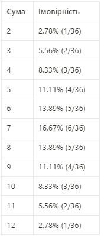

# goit-algo-fp
Final project on algorithms and data structures.

## Overview
This project encompasses various tasks related to data structures, algorithms, and visualizations. Each task demonstrates the application of specific techniques, from linked lists to dynamic programming.

## Tasks Summary

### Task 1: Data Structures - Linked List
- Implemented a function to reverse a singly linked list by modifying node references.
- Developed an algorithm to sort a singly linked list, utilizing a chosen sorting method (e.g., insertion sort).
- Created a function to merge two sorted singly linked lists into one sorted list.

### Task 2: Recursion - Pythagorean Tree Fractal
- Created a Python program to visualize a Pythagorean tree fractal using recursion.
- The user can specify the level of recursion to control the depth of the fractal.

### Task 3: Trees - Dijkstra's Algorithm
- Implemented Dijkstra's algorithm to find the shortest paths in a weighted graph using a binary heap for optimization.
- Constructed a graph and used the heap to efficiently select vertices and compute shortest paths from a starting vertex to all others.

### Task 4: Visualization - Binary Heap
- Developed a function to visualize a binary heap using the `networkx` and `matplotlib` libraries.
- Used the `heapify` method to create a binary heap from a list of values.

### Task 5: Tree Traversals Visualization
- Implemented depth-first search (DFS) and breadth-first search (BFS) algorithms to visualize tree traversals.
- Nodes were colored differently based on the traversal order, enhancing visual clarity.

### Task 6: Greedy Algorithms and Dynamic Programming
- Created a greedy algorithm function to maximize calorie-to-cost ratios for food selection within a given budget.
- Implemented a dynamic programming approach to compute the optimal food selection for maximizing calories without exceeding the budget.
- Each food item can only be used once in the selection process.

### Task 7: Monte Carlo Method
- Simulated rolling two dice multiple times to compute the sums of the results.
- Generated a probability table for each possible sum (from 2 to 12) based on the simulation results.
- Compared the results obtained via the Monte Carlo method with analytical calculations.
- The results obtained via the Monte Carlo method are almost identical with Table of sum prices.
- 
- 

## Conclusions
- Each task successfully meets its requirements and demonstrates fundamental principles in data structures and algorithms.
- Visualizations aid in understanding complex concepts such as tree structures and traversal methods.
- The use of different programming paradigms (recursive vs. iterative) showcases the versatility of Python in solving various problems.

## Future Work
- Consider expanding visualizations to include interactive elements.
- Explore more advanced algorithms and data structures for further learning and application.

## Requirements
- Python 3.x
- Libraries: `networkx`, `matplotlib`

---